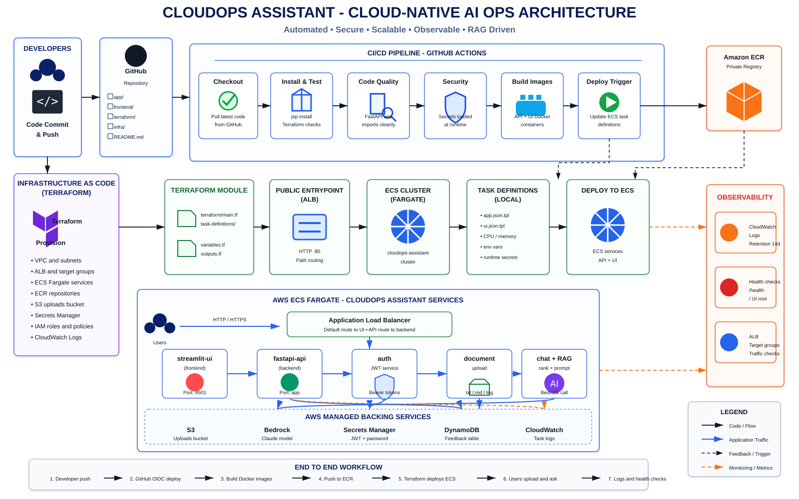
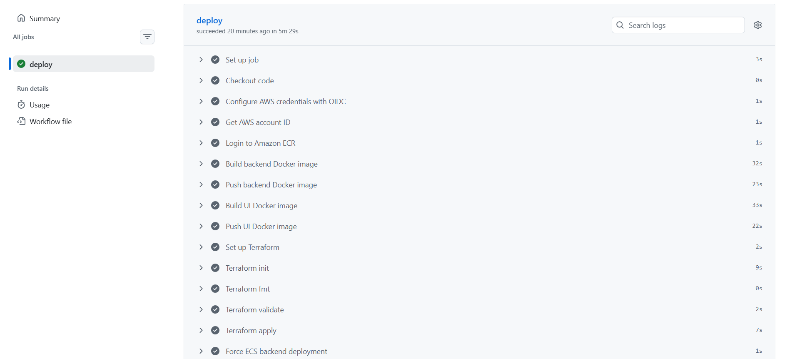
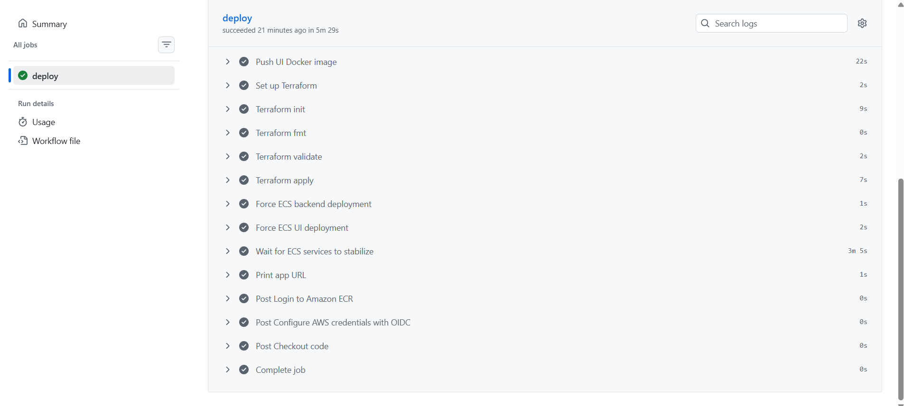
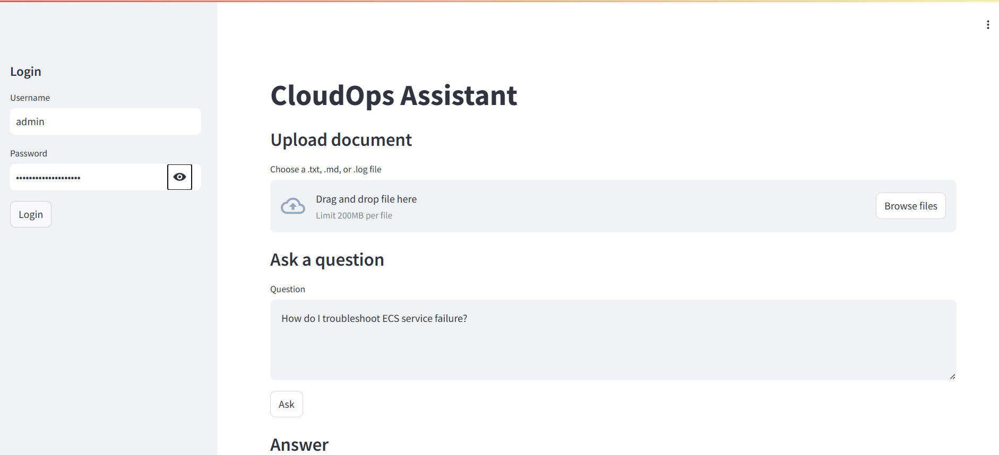
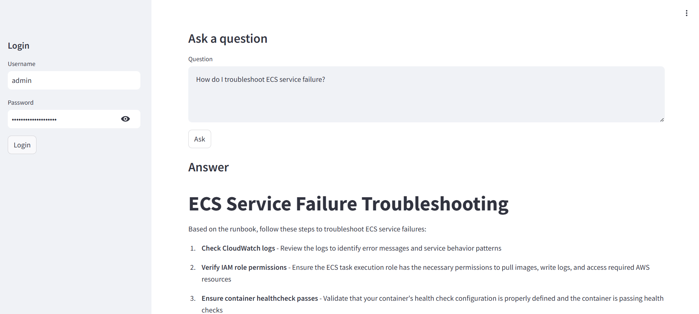

# CloudOps Assistant

CloudOps Assistant is a cloud-native internal knowledge assistant for DevOps and platform teams. It lets users upload operational documents, ask natural-language questions, and receive grounded answers generated from the uploaded context using a lightweight RAG workflow on AWS.

The project demonstrates a production-style path from source code to AWS ECS Fargate using GitHub Actions, OIDC-based AWS authentication, Terraform, Amazon ECR, an Application Load Balancer, Amazon S3, Amazon Bedrock, Secrets Manager, IAM, and CloudWatch Logs.

## Highlights

- Streamlit web UI for login, document upload, questions, answers, and source snippets.
- FastAPI backend with JWT-protected API routes.
- Retrieval workflow that reads uploaded documents from S3, chunks content, ranks relevant snippets, and builds a Bedrock prompt.
- Amazon Bedrock integration using an Anthropic Claude model.
- Encrypted S3 document storage for uploaded `.txt`, `.md`, and `.log` files.
- Feedback endpoint for thumbs up/down response quality logging.
- Dockerized frontend and backend services.
- Terraform-managed AWS infrastructure.
- GitHub Actions deployment pipeline with AWS OIDC, ECR image publishing, Terraform apply, and ECS service stabilization.

## Architecture



The deployed application uses one public Application Load Balancer. Default web traffic is routed to the Streamlit UI service, while `/api/*`, `/health`, `/docs`, and `/openapi.json` are routed to the FastAPI backend service. Both services run as ECS Fargate tasks and pull container images from Amazon ECR.

Uploaded documents are stored in Amazon S3. Chat requests retrieve and rank document chunks before invoking Amazon Bedrock. Runtime secrets are loaded from AWS Secrets Manager, and application logs are sent to CloudWatch Logs.

## Screenshots

### GitHub Actions Deployment

The deployment workflow builds backend and UI images, pushes them to Amazon ECR, runs Terraform, forces fresh ECS deployments, waits for service stability, and prints the deployed app URL.





### CloudOps Assistant UI

Users authenticate from the sidebar, upload supported operational documents, and ask CloudOps questions against the uploaded knowledge base.



The assistant returns a practical answer based on the retrieved document context.



## Repository Structure

```text
.
+-- app/
|   +-- api/                  # FastAPI routers for chat, upload, and feedback
|   +-- auth/                 # JWT creation, verification, and login handling
|   +-- db/                   # DynamoDB feedback helper
|   +-- monitoring/           # Request latency tracking helper
|   +-- services/             # S3, Bedrock, retrieval, ranking, and versioning services
+-- frontend/
|   +-- Dockerfile
|   +-- streamlit_app.py      # Streamlit user interface
+-- infra/
|   +-- Dockerfile            # Backend Docker image
|   +-- github-actions.yml    # Starter CI workflow
+-- terraform/
|   +-- main.tf               # AWS infrastructure
|   +-- variables.tf
|   +-- outputs.tf
|   +-- task-definitions/     # ECS task definition templates
+-- .github/workflows/
|   +-- deploy.yml            # AWS deployment workflow
+-- docs/
|   +-- architecture.md
|   +-- cloudops-assistant-architecture.svg
|   +-- images/
+-- requirements.txt
```

## Application Flow

1. A user opens the ALB URL and loads the Streamlit UI.
2. The user logs in with application credentials and receives a JWT.
3. The user uploads a `.txt`, `.md`, or `.log` document.
4. The FastAPI backend versions the filename and stores the document in S3.
5. The user asks a question through the UI.
6. The backend retrieves documents from S3, chunks the text, ranks matching chunks, and builds a grounded prompt.
7. Amazon Bedrock generates an answer using the selected model.
8. The UI displays the answer and source snippets.
9. Optional feedback is sent to the feedback API and written to DynamoDB when the table is available.

## API Endpoints

| Method | Endpoint | Purpose |
| --- | --- | --- |
| `GET` | `/health` | Backend health check |
| `POST` | `/api/login` | Authenticate and return a bearer token |
| `POST` | `/api/upload` | Upload a supported document to S3 |
| `GET` | `/api/documents` | List uploaded documents |
| `POST` | `/api/chat` | Ask a question against uploaded documents |
| `POST` | `/api/feedback` | Save answer feedback |
| `GET` | `/docs` | FastAPI Swagger UI |

## Local Development

### Backend

```bash
python -m venv .venv
.venv\Scripts\activate
pip install -r requirements.txt
uvicorn app.main:app --reload
```

For macOS or Linux, activate the virtual environment with:

```bash
source .venv/bin/activate
```

### Frontend

```bash
streamlit run frontend/streamlit_app.py
```

The frontend expects an API base URL. In production this is routed through the ALB. For local testing, set the API base in `frontend/streamlit_app.py` or provide a local environment-driven value before running Streamlit.

## Environment Variables

| Variable | Used By | Description |
| --- | --- | --- |
| `AWS_REGION` | Backend, Terraform, deployment | AWS region for Bedrock, S3, ECS, ECR, and supporting services |
| `S3_BUCKET_NAME` | Backend | S3 bucket used for uploaded documents |
| `BEDROCK_MODEL_ID` | Backend | Amazon Bedrock model ID |
| `APP_USERNAME` | Backend | Login username |
| `APP_PASSWORD` | Backend | Login password, provided through Secrets Manager in ECS |
| `JWT_SECRET` | Backend | JWT signing secret, provided through Secrets Manager in ECS |
| `DYNAMODB_TABLE_NAME` | Backend | Feedback table name, defaults to `cloudops-feedback` |
| `API_BASE` | Frontend task definition | Base URL for FastAPI routes |

## AWS Infrastructure

Terraform provisions the core runtime platform:

- Amazon ECR repositories for backend and UI images.
- Encrypted S3 bucket for uploaded documents.
- Application Load Balancer with route-based forwarding.
- ECS Fargate cluster, task definitions, and services.
- ECS task execution and task IAM roles.
- Secrets Manager secrets for the JWT secret and app password.
- CloudWatch log group for backend and UI task logs.
- Security groups for ALB-to-ECS access.

The feedback service writes to DynamoDB through `app/db/dynamodb.py`. The application defaults to a table named `cloudops-feedback`; ensure that table exists or add it to Terraform before relying on feedback persistence.

## CI/CD Deployment

The main deployment workflow is `.github/workflows/deploy.yml`.

On push to `main` or manual `workflow_dispatch`, it performs:

1. Checkout source code.
2. Configure AWS credentials using GitHub OIDC.
3. Resolve the AWS account ID.
4. Log in to Amazon ECR.
5. Build and push the backend Docker image.
6. Build and push the UI Docker image.
7. Initialize, format, validate, and apply Terraform.
8. Force new ECS deployments for backend and UI services.
9. Wait for ECS services to stabilize.
10. Print the deployed application URL.

Required GitHub configuration:

| Name | Type | Purpose |
| --- | --- | --- |
| `AWS_ROLE_ARN` | Repository secret | IAM role assumed by GitHub Actions through OIDC |

The trust policy example is stored in `github-actions-trust-policy.json`.

## Security Notes

- GitHub Actions uses OIDC instead of static AWS access keys.
- ECS runtime secrets are supplied from AWS Secrets Manager.
- S3 public access is blocked and server-side encryption is enabled.
- Application routes that mutate or retrieve private data require JWT authentication.
- ECS tasks use IAM roles for AWS service access.

## Current Limitations

- Document retrieval uses simple text chunking and keyword-count ranking rather than vector embeddings.
- The Streamlit API base is currently hardcoded in `frontend/streamlit_app.py`; the ECS task definition also provides `API_BASE`.
- Terraform does not currently declare the DynamoDB feedback table even though the feedback endpoint can write to DynamoDB.
- The ALB listener is HTTP-only in the current Terraform configuration; production deployments should add HTTPS with ACM.

## Useful Commands

```bash
# Run backend locally
uvicorn app.main:app --reload

# Run frontend locally
streamlit run frontend/streamlit_app.py

# Format and validate Terraform
terraform -chdir=terraform fmt -recursive
terraform -chdir=terraform validate
```

## Documentation

- [Architecture notes](docs/architecture.md)
- [Standalone Mermaid architecture diagram](docs/cloudops-architecture.mmd)
- [SVG architecture diagram](docs/cloudops-assistant-architecture.svg)
