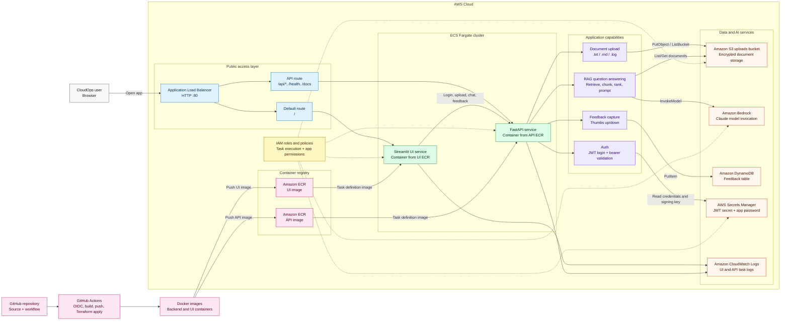

# CloudOps Assistant Architecture

The CloudOps Assistant is a containerized internal knowledge assistant. Users access a Streamlit frontend through an AWS Application Load Balancer. The load balancer serves the UI by default and routes API paths to a FastAPI backend running on ECS Fargate.

## Request Flow

1. The user opens the public ALB URL.
2. The ALB sends normal web traffic to the Streamlit UI service.
3. API paths are routed to the FastAPI service.
4. Users log in with app credentials and receive a JWT.
5. Uploaded documents are versioned by the API and stored in the encrypted S3 uploads bucket.
6. Chat requests retrieve document text from S3, chunk and rank candidate snippets, then invoke Amazon Bedrock.
7. Feedback is accepted by the API and written to DynamoDB.
8. UI and API task logs are shipped to CloudWatch Logs.

## Implementation Notes

- Terraform defines the ALB, ECS cluster, ECS services, task definitions, ECR repositories, S3 bucket, Secrets Manager secrets, IAM roles, and CloudWatch log group.
- The FastAPI application uses JWT authentication for `/api/upload`, `/api/documents`, `/api/chat`, and `/api/feedback`.
- The feedback code expects a DynamoDB table named `cloudops-feedback` by default, but the table is not currently declared in `terraform/main.tf`.
- The repository contains a GitHub Actions deployment workflow that authenticates to AWS with OIDC, builds and pushes backend and UI Docker images, applies Terraform, and forces ECS service deployments.
